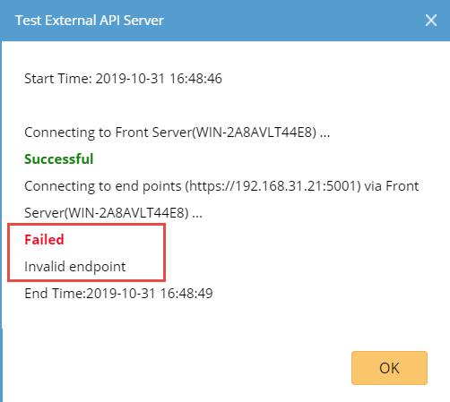

>   NetBrain Integration Deployment Guide

>   Single Pane of Glass – Technical Assistance Center (TAC)

>   Contents

Use Case
========

Description
-----------

>   NetBrain will retrieve Cisco device issue data from Cisco Connected TAC
>   bridge server and display it on NetBrain map as DataView. Network engineers
>   can using those data to further troubleshoot device issues.

>   The Data View includes:

-   Issue Count

-   Severity

-   Severity_Int

-   Name

-   External_Title

-   External_Text

NetBrain Single Pane of Glass Result Sample
-------------------------------------------

Pre-requisites
==============

Application Version
-------------------

| Application | Version          |
|-------------|------------------|
| NetBrain    | IEv8.0 and above |

Network Connectivity
--------------------

| Source                | Destination             | Protocol   |
|-----------------------|-------------------------|------------|
| NetBrain Front Server | Cisco TAC bridge server | HTTP/HTTPS |

User Account and Privileges
---------------------------

| Application | User Account | Role                                                |
|-------------|--------------|-----------------------------------------------------|
| NetBrain    | Required     | System Admin                                        |
| Cisco TAC   | Required     | Any role that can using API and query device issues |

Deployment Instruction
======================

Create API Adaptor
------------------

1.  Download **Cisco TAC API Adaptor.py** file.

2.  Login NetBrain System Management page.

3.  Navigate to **Operations API Adaptors**.

4.  Click **Add** button.

5.  Fill out the form with following information:

    -   Adapter Name: **Cisco TAC API Adapter.**

    -   Description: **Cisco TAC API Adapter.**

    -   Script: Click Import button to import the downloaded Cisco TAC API
        Adaptor.py file.

6.  Click **Save** button.

Create External API Server
--------------------------

1.  Login NetBrain Desktop.

2.  Open the Domain Management page and navigate to **Operations API Server
    Manager**.

3.  Click **Add** button.

4.  Fill out the form with following information:

    -   Server Name: Cisco TAC

    -   Description: Cisco TAC

    -   API Source Type: Select “**Cisco TAC API Adapter**” API Adapter created
        in last section.

    -   Endpoints: Cisco Bridge Server and port number, i.e.
        “https://192.168.31.68:5001”.

    -   Username: Cisco TAC login username.

    -   Password: Cisco TAC login password.

    -   Front Server/Front Server Group: Select a proper FS/FSG.

5.  Click Test button to test the connectivity.

    -   Successful

-   Invalid credentials

-   Invalid endpoint

1.  With a successful test, click **OK** button to save.

Import Data View Template
-------------------------

1.  Download **Cisco TAC.xdvt** file.

2.  Login NetBrain Desktop.

3.  Navigate to Main Menu **Data View Template Manager**.

    

4.  Select **Import Template** in target directory.

    

5.  Click **Add Data View Template …** button.

6.  Select the downloaded file from Step 1.

7.  Click **Import** button to complete.

8.  Navigate to **Parser Library** from Main Menu.

9.  Search for **Cisco TAC Parser** and open it.

10. In Parser Type dropdown lists, select API + **Cisco TAC API Adapter**.

Update Device Shared Device Settings
------------------------------------

1.  Login NetBrain Desktop.

2.  Create **Device Group** based on managed FS/FSG.

3.  Map one device to a map.

4.  Right click the device and select “**Shared Device Settings**”.

5.  Click on **API** tab.

6.  From API Plugin section, find API Source Type “**Cisco TAC API Adapter**”.

7.  Select “**Cisco TAC**” as the **External API Servers**.

8.  Check “**Apply above Settings to device group**”.

9.  Check **Cisco TAC API Adapter** row in API Plugin section of API tab.

10. Select the Device Group created in Step 2.

11. Click **Submit** button to save.

How to run this Data View Template
==================================

On demand
---------

1.  Map devices onto a map.

2.  Search for **Cisco TAC**” in Data View area.

3.  Click it.

4.  Click **Apply** button.

5.  Make sure it runs live, not cache.

6.  Review the Data View result from map.

Scheduled
---------

1.  Schedule the DVT from Domain Management **Schedule Task**.

2.  After it first time execution, check DVT result from map.

Support & Services
==================

>   If there are any problems during deployment, contact NetBrain Support at
>   [support\@netbraintech.com.](mailto:support@netbraintech.com)
