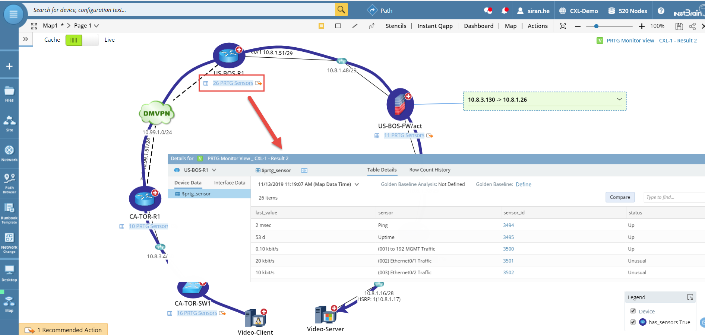
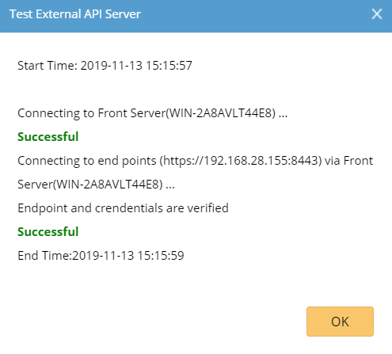
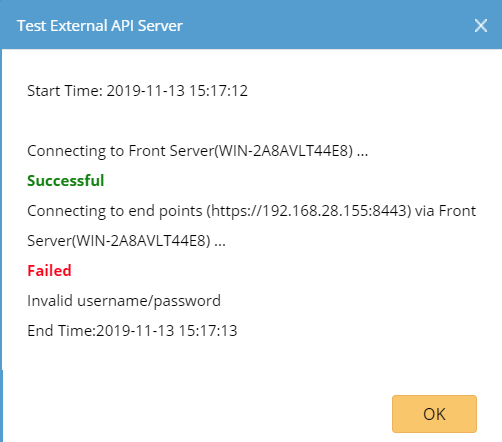
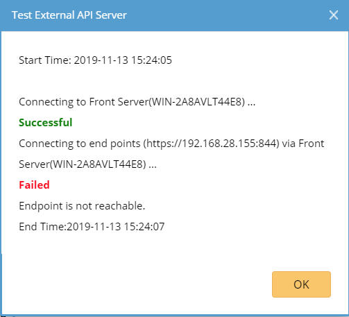

NetBrain Integration Deployment Guide
=====================================

Single Pane of Glass – PRTG Monitor Sensor Data
------------------------------------------------------------

Use Case
========

Description
-----------

NetBrain has created an integration compatible with NetBrain Integrated Edition
release 8.0 (and newer) that enables a NetBrain administrator to overlay each
PRTG device sensors data on user created maps, at the meantime, NetBrain
provides Hyperlink on each Sensor ID to open the corresponding PRTG sensor page.

With this integration, NetBrain can overlay the following information of each
sensor:

| Sensor Name | Sensor ID                                                                                                                   | Status | Last Value |
|-------------|-----------------------------------------------------------------------------------------------------------------------------|--------|------------|
| Ping        | [3494](file:///E:\Dropbox%20(NT)\Advanced%20Services\Customization%20Folder\Integration\Documentation\8.01%20PRTG\YourPRTG) | Up     | 2 msec     |

NetBrain Map with PRTG Data Overlay
-----------------------------------

Below is an example representation of the PRTG all sensors data overlay on each
device in NetBrain.

Pre-requisites
==============

Application Version
-------------------

| Application                 | Version             |
|-----------------------------|---------------------|
| NetBrain Integrated Edition | IEv8.0 (or newer)   |
| PRTG                        | PRTG 17.4(or newer) |

Network Connectivity
--------------------

| Source                | Destination | Protocol   |
|-----------------------|-------------|------------|
| NetBrain Front Server | PRTG Server | HTTP/HTTPS |

User Account and Privileges
---------------------------

| Application                 | User Account | Required Role Assignment(s) |
|-----------------------------|--------------|-----------------------------|
| NetBrain Integrated Edition | Required     | System Admin                |
| PRTG                        | Required     | Read-only User (or higher)  |

Deployment Instructions
=======================

Deploy the NetBrain PRTG API Adaptor
------------------------------------

1.  Download the NetBrain PRTG API Adapter, *PRTG API Adaptor.py*, from the
    NetBrain GitHub and stage locally on the machine typically used to connect
    to the NetBrain User Interface.

2.  Using a web browser, login to the NetBrain **System Management** UI using
    the *System Admin* credentials

    *http://\<NetBrain Web Server IP\>/admin*

3.  In the NetBrain System Management UI, Navigate to *Operations API Adaptors*.

4.  In the API Adaptors screen, click “**Add**”.

5.  Complete the *Add API Adaptor* dialog screen as follows:

>   **Adapter Name:** *PRTG API Adaptor*

>   **Description:** *NetBrain PRTG API Adaptor*

>   **Script:** *\<PRTG API Adaptor.py\>*

1.  Review the adaptor configuration, then click “**Save**”.

2.  Log out of the Netbrain Integrated Edition System Management UI.

Create PRTG API Server Connection
---------------------------------

**Note:** If the environment has been deployed with multiple Front Servers,
repeat this section for each of the Front Servers.

1.  Using a web browser, login to the NetBrain **Desktop** UI using the *System
    Admin* credentials

    http://\<NetBrain Web Server IP\>

2.  Navigate to the NetBrain *API Server Manager*

    *Domain Management Operations API Server Manager*

3.  In the **API Server Manager** screen, click “**Add**”.

4.  Complete the Add API Server dialog screen as follows:

>   **Server Name:** *PRTG API Server \<Front Server\>*

>   **Description:** *PRTG*

>   **API Source Type:** *“PRTG API Adaptor”*

>   **Endpoint:** *PRTG instance endpoint (ex “http://192.168.31.92”)*

>   **Username:** *PRTG login account’s username*

>   **Password:** *PRTG login account’s password*

>   **Front Server/Front Server Group:** Select FS/FSG which would have
>   reachability to PRTG server

1.  Click “**Test**” to initiate a connectivity test between the NetBrain front
    server and the PRTG instance configured. Pictured below is the result of a
    successful connectivity test followed by two typical failure scenarios:
    Incorrect credentials and connectivity between NetBrain and PRTG.

| **Successful Connection**                                                                                                                                                                            || 
|------------------------------------------------------------------------------------------------------------------------------------------------------------------------------------------------------|------------------------------------------|
| **Error Scenario:** Invalid username/password. **Possible Resolution:** Confirm credentials specified in the PRTG API Adaptor configuration and try it agin.                                         | |
| **Error Scenario:** PRTG endpoint is unreachable. **Possible Resolution:** Confirm that the NetBrain Front Server(s) can reach the PRTG platform using 3rd party tools (Ping, Traceroute, Wireshark) | |

2.  Once successful connection with the local PRTG instance has been confirmed,
    click “**OK**” to finalize PRTG server connection.

3.  Repeat Steps 2-6 for each additional deployed Front Server.

 Import PRTG Data View Template
-------------------------------

1.  Download the NetBrain PRTG Dataview Template, *PRTG Monitor Sensor
    Data.xdvt*, from the NetBrain GitHub and stage locally on the machine used
    to connect to the NetBrain User Interface.

2.  Using a web browser, login to the NetBrain **Desktop** UI with the *System
    Admin* credentials

    *http://\<NetBrain Web Server IP\>*

3.  Navigate to the NetBrain *Data View Template Manager*

    *Start Menu (The Four Dashed Lines) Dynamic Map Data View Template Manager*

4.  Right-Click “**Shared Templates in Tenant**”, then click “**New Folder**”.

5.  Name the folder *PRTG Single Pane of Glass*

6.  Right-Click the “**PRTG Single Pane of Glass**” folder, then click “**Import
    Template**”

7.  In the *Import Data View Template* dialog, click “**Add Data View Template
    …**”

8.  Select the *PRTG Monitor Sensor Data.xdvt* file, then click “**Open**”.

9.  Confirm that the *Import Data View Template* dialog screen reflects the
    following information:

    **Name:** PRTG Monitor Sensor Data.xdvt

    **Size:** *291.66k*

    **Status:** *Ready*

    **Related Resources:** *1 Parsers*

10. Click “**Import**” to initiate the import of the data view template to the
    NetBrain system.

>   **Note:** On successful completion, the status will transition from *Ready*
>   to *Successful.* If any other status is reported, retry the operation, then
>   contact NetBrain support.

1.  Navigate to NetBrain *Parser Library*

    *Start Menu (The Four Dashed Lines) Automation Parser Library*

2.  In the Parser Library, search for “PRTG“. One PRTG parser should be returned
    in the search results:

>   *[PRTG] Monitor Sensor Data*

1.  Double-click *[PRTG] Monitor Sensor Data* to open the custom parser in the
    *Parser Editor*.

2.  In the *Parser Editor*, update the *Parser Type* associated with the *[PRTG]
    Monitor Sensor Data* to the following:

>   **Parser Type:** *API, PRTG API Adaptor*

1.  Click the Save icon in the upper-right corner of the screen, then close the
    browser tab.

Creating PRTG Enabled Device Groups
-----------------------------------

**Note:** If the environment has been deployed with multiple Front Servers,
repeat this section for each of the Front Servers.

1.  Navigate to the NetBrain *Device Group Manager.*

    *Start Menu (The Four Dashed Lines) Device Group*

2.  In the *Device Group Manager*, right-click the “**Public**” folder, then
    click “**New Device Group**”.

3.  In the *Device Group Properties* dialog, Name the device group as follows:

>   *[PRTG] DG \<Front Server Hostname\>*

1.  Under *Devices and Interfaces*, click “**+Dynamic Search”,** then “**Dynamic
    Search Device**”.

2.  In the *Dynamic Search Device* dialog,

    **Search Scope:** *All Devices (default)*

    **Device Criteria:** *Front Server \| Matches \| \<Front Server\>*

    where *\<Front Server\>* is the front server specified in step 3.

3.  Click “**Search**” to populate the device list to front server mapping.

4.  Click “**OK**” button to create a Dynamic Search association.

5.  In the *Device Group Properties* dialog, click “**OK**” to complete Device
    Group creation.

6.  In the *Device Group Manager*, right-click the *[PRTG] DG\<Front Server
    Hostname\>* object, then click “**Open Group Map**”.

7.  In the resulting NetBrain device group map, right-click any device, then
    click “*Shared Device Settings*”.

8.  In the *Shared Device Settings…* dialog, click the select the *API* tab then
    populate the dropdown fields as follows:

    *PRTG API Adaptor \| PRTG API Server \<Front Server\> \| \<Select Front
    Server\>*

9.  Check “*Apply above Settings to device group*”, then select *[PRTG] DG
    \<Front Server Hostname\>*

10. In the API tab content table, check *PRTG API Adaptor*

11. Click “**Submit**”.

12. Repeat steps 1-14 for each additional deployed Front Server.

Adding PRTG URL on Sensor ID
============================

 Create Generic Variable
------------------------

1.  Navigate to the *NetBrain Generic Variable.*

    *Start Menu (The Four Dashed Lines) Single Pane of Glass URL NetBrain
    Generic Variable*

2.  Click “**Add**” button to add a new Generic Variable, and provide following
    information:

    **Name:** PRTG

    **Value:** \<The URL to browse to PRTG\>. (ex
    “<https://192.168.28.155:8443>”)

Create a Page Link
------------------

1.  Navigate to the *Page Link.*

    *Start Menu (The Four Dashed Lines) Single Pane of Glass URL Page Link*

2.  Click “*Add Page Link*” and provide following information:

    **Page Name**: Sensor

    **Page URL:** (ex “**{\$\$PRTG}/sensor.htm?id={\$sensor_id}**”)

-   Click plus sign on right side, select “*Insert Generic Variable*”, then
    “*PRTG*”.

-   Manually type “**/sensor.htm?id=**”

-   Click plus sign on right side, select “*Insert Parser Variable*” and then
    navigate *[PRTG] Monitor Sensor Data* parser in *Shared Parsers in Tenant
    folder*, then select *sensor_id*.

Add Link to DataView Template
-----------------------------

1.  Navigate to the *PRTG Monitor Sensor Data* in *Data View Template Manager*

>   *Start Menu (The Four Dashed Lines) Dynamic Map Data View Template Manager
>   Shared Templates in Tenant* **PRTG Single Pane of Glass PRTG Monitor Sensor
>   Data**

1.  Click “**Sensor_Detail(table)”** under the device icon

2.  Click *“+Add Action*” then **SPOG URL**

3.  Select *Sensor* and click “*Select*”.

4.  Click the **Save** button in the upper-right corner of the screen, then
    close the browser tab.

Visualizing the PRTG Data with NetBrain Data View Template
==========================================================

On-Demand Data Overlay
----------------------

1.  From the NetBrain *Desktop Management* UI, open the desired map to overlay
    PRTG data.

2.  In *Dynamic Data View* tab, search for “*PRTG Monitor Sensor Data*”.

3.  In the *Preview – Data View Template* dialog, click “*Apply*”

4.  On the NetBrain map, confirm that the *Cache/Live* data source switch is set
    to *Live.*

5.  Confirm that the objects (devices and interfaces) are properly instrumented
    with the expected PRTG data.

    **Note:** Overlay of the PRTG data may take seconds-to-minutes to complete
    refresh depending on the number of devices on the map.

Schedule Data Import from PRTG
------------------------------

1.  In the *NetBrain Domain Management* page, navigate to *Schedule Task*.

2.  Click on “**Schedule Data View Template/Parser**”, then click on “**Add
    Task**”

3.  In the *Add Task* dialog, specify the frequency for which to import device
    and interface data from PRTG.

4.  Click on “**Device Scope**” tab, then click “**Device Group**” radio button.
    Add each device group created as part of the integration to limit device
    scope of the available devices.

5.  Click on “**Select Data View Template/Parser**” tab, click on “**Add**” and
    search for *[PRTG] Monitor Sensor Data*

6.  Click “*Submit*” to create the scheduled task for PRTG data import to
    NetBrain.

>   **Note:** The PRTG data will not be available on the map until after the
>   first time that the scheduled task has completed execution.

Troubleshooting
===============

If there are any problems encountered during deployment or integration of
NetBrain with PRTG, contact NetBrain Support at *support\@netbraintech.com*.
