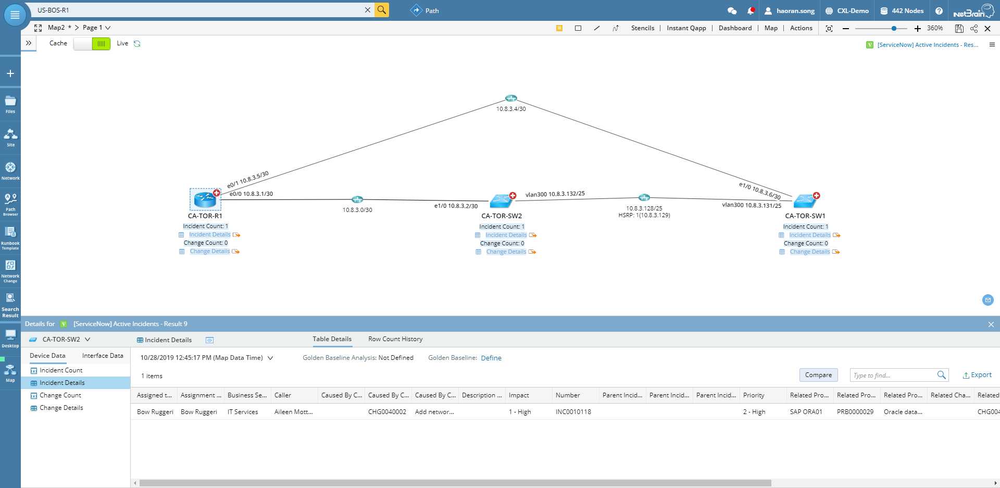
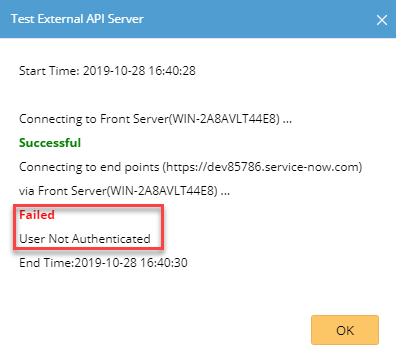
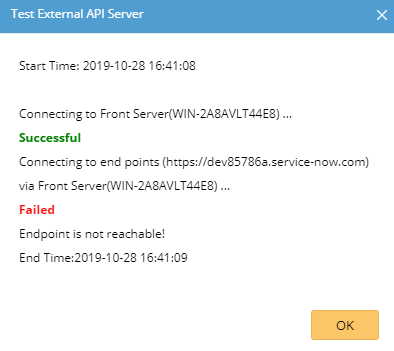

NetBrain Integration Deployment Guide
=====================================

Single Pane of Glass – ServiceNow Active Incidents & Changes
------------------------------------------------------------

Use Case
========

Description
-----------

This use case visualizes ServiceNow active Incident and Change Request tickets
to NetBrain dynamic maps based on device. Network engineers can check potential
affective incidents and changes during troubleshooting process, for Change
Management purposes, and for documentation purposes.

Hyperlink of each ticket is available for users to quickly navigate to
ServiceNow ticket instance.

NetBrain Single Pane of Glass Result Sample
-------------------------------------------

Pre-requisites
==============

Application Version
-------------------

| Application | Version          |
|-------------|------------------|
| NetBrain    | IEv8.0 and above |
| ServiceNow  | Madrid, New York |

Network Connectivity
--------------------

| Source                | Destination         | Protocol   |
|-----------------------|---------------------|------------|
| NetBrain Front Server | ServiceNow Instance | HTTP/HTTPS |

User Account and Privileges
---------------------------

| Application | User Account | Role                                                       |
|-------------|--------------|------------------------------------------------------------|
| NetBrain    | Required     | System Admin                                               |
| ServiceNow  | Required     | Any role that can query Incident and Change Request tables |

Deployment Instruction
======================

Create API Adaptor
------------------

1.  Download ServiceNow API Adaptor.py file.

2.  Login NetBrain System Management.

3.  Navigate to Operations API Adaptors.

4.  Click Add button.

5.  Fill out the form with following information:

    -   Adapter Name: **ServiceNow API Adapter**

    -   Description: **ServiceNow API Adapter.**

    -   Script: **Click Import button to import the downloaded ServiceNow API
        Adaptor.py file.**

6.  Click Save button.

Create External API Server
--------------------------

1.  Login NetBrain Desktop.

2.  Navigate to Domain Management Operations API Server Manager.

3.  Click Add button.

4.  Fill out the form with following information:

    -   Server Name: ServiceNow

    -   Description: ServiceNow

    -   API Source Type: Select “ServiceNow API Adapter” API Adapter created in
        last section.

    -   Endpoints: ServiceNow instance endpoint, i.e.
        “[https://dev85786.service-now.com](https://dev85786.service-now.com/)”.

    -   Username: ServiceNow username.

    -   Password: ServiceNow password.

    -   Front Server/Front Server Group: Select a proper FS/FSG.

5.  Click Test button to test the connectivity.

    -   Successful

    

    -   Invalid credentials

    

    -   Unreachable endpoint

    

6.  With a successful test, click OK button to save.

Import Data View Template
-------------------------

1.  Download [ServiceNow] Active Incidents & Changes.xdvt file.

2.  Login NetBrain Desktop.

3.  Navigate to Main Menu Data View Template Manager.

4.  Select Import Template in target directory.

5.  Click Add Data View Template … button.

6.  Select the downloaded file from Step 1.

7.  Click Import button to complete.

8.  Navigate to Parser Library.

9.  Search for Change Table [ServiceNow] and Incident Table [ServiceNow].

10. Open both parsers.

11. In Parser Type dropdown lists, select API + ServiceNow.

Update Device Shared Device Settings
------------------------------------

1.  Login NetBrain Desktop.

2.  Create Device Group based on managed FS/FSG.

3.  Map one device to a map.

4.  Right click the device and select “Shared Device Settings”.

5.  Click on API tab.

6.  From API Plugin section, find API Source Type “ServiceNow API Adapter”.

7.  Select “ServiceNow” as the External API Servers.

8.  Check “Apply above Settings to device group”.

9.  Check ServiceNow API Adapter row in API Plugin section of API tab.

10. Select the Device Group created in Step 2.

11. Click Submit button to save.

How to run this Data View Template
==================================

On demand
---------

1.  Map devices onto a map.

2.  Search for “[ServiceNow] Active Incidents & Changes”.

3.  Click it.

4.  Click Apply button.

5.  Make sure it runs live, not cache.

6.  Review the Data View result from map.

Scheduled
---------

1.  Schedule the DVT from Domain Management Schedule Task.

2.  After it first time execution, check DVT result from map.

Support & Services
==================

If there is any problems during deployment, contact NetBrain Support at
*support\@netbraintech.com*.
