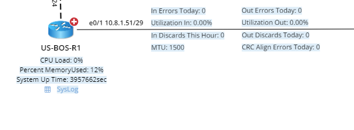
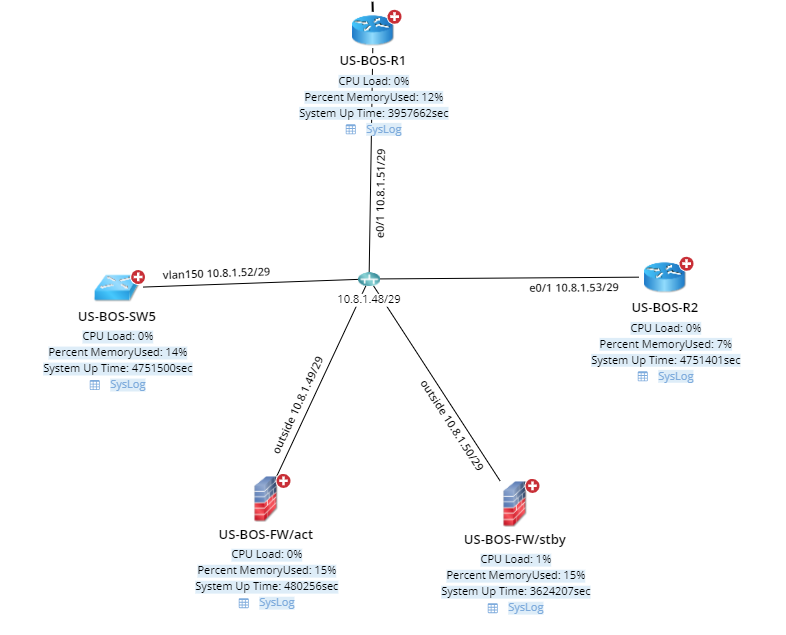
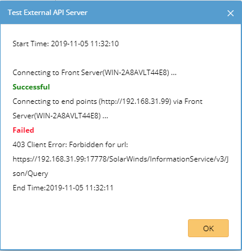
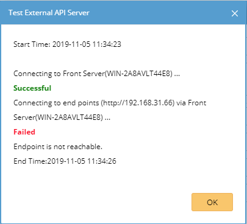

NetBrain Integration Deployment Guide
=====================================

Single Pane of Glass – Solarwinds Device Monitoring
------------------------------------------------------------

Use Case
========

Description
-----------

This use case visualizes Solarwinds monitoring data upon NetBrain dynamic maps
based on device. The data view visualizes the following data on device level:
1.  CPU Load% (Map URL to Solarwinds device details)
2.  Memory Used %
3.  System Uptime
4.  SysLog messages

Following data is seen on the interface level:
1.  Utilization In %
2.  Utilization Out %
3.  In Discards This Hour
4.  Out Discards This Hour
5.  In Errors This Today
6.  Out Errors This Today
7.  CRC Align Errors Today
8.  MTU

NetBrain Single Pane of Glass Result Sample
-------------------------------------------

Pre-requisites
==============

Application Version
-------------------

| Application        | Version                  |
|--------------------|--------------------------|
| NetBrain           | IEv8.0 and above         |
| Solarwinds version | Orion NMP 12.2 and above |

Network Connectivity
--------------------

| Source                | Destination       | Protocol   |
|-----------------------|-------------------|------------|
| NetBrain Front Server | Solarwinds server | HTTP/HTTPS |

User Account and Privileges
---------------------------

| Application | User Account | Role                                    |
|-------------|--------------|-----------------------------------------|
| NetBrain    | Required     | System Admin                            |
| Solarwinds  | Required     | Any role that can query monitoring data |

Deployment Instruction
======================

Import OrionSDK library in NetBrain
-----------------------------------

1.  Download “orion.zip” file

2.  RTP into every instance of Front Server and place “orion.zip” file

3.  Unzip the file and place following folders inside Front Server’s python
    library

    1.  orionsdk

    2.  orionsdk-0.0.6.dist-info

        Front Server’s python library location:  
        C:\\Program Files\\NetBrain\\Front Server\\python\\Lib\\site-packages

Create API Adaptor
------------------

1.  Download Solarwinds API Adaptor.py file.

2.  Login NetBrain System Management.

3.  Navigate to Operations API Adaptors.

4.  Click Add button.

5.  Fill out the form with following information:

    -   Adapter Name: **Solarwinds API Adapter**

    -   Description: **Solarwinds API Adapter.**

    -   Script: **Click Import button to import the downloaded Solarwinds API
        Adaptor.py file.**

6.  Click Save button.

Create External API Server
--------------------------

1.  Login NetBrain Desktop.

2.  Navigate to Domain Management Operations API Server Manager.

3.  Click Add button.

4.  Fill out the form with following information:

    -   Server Name: Solarwinds

    -   Description: Solarwinds

    -   API Source Type: Select “Solarwinds API Adapter” API Adapter created in
        last section.

    -   Endpoints: Solarwinds instance endpoint, i.e. “http://192.168.31.99”.

    -   Username: Solarwinds username.

    -   Password: Solarwinds password.

    -   Front Server/Front Server Group: Select a proper FS/FSG.

5.  Click Test button to test the connectivity.

    -   Successful

        

    -   Invalid credentials

        

    -   Unreachable endpoint

        

6.  With a successful test, click OK button to save.

 Import Data View Template
--------------------------

1.  Download [Solarwinds] Monitoring Data.xdvt file.

2.  Login NetBrain Desktop.

3.  Navigate to Main Menu Data View Template Manager.

4.  Select Import Template in target directory.

5.  Click Add Data View Template … button.

6.  Select the downloaded file from Step 1.

7.  Click Import button to complete.

8.  Navigate to Parser Library.

9.  Search for Solarwinds - Device DVT, Solarwinds - Interface DVT and
    Solarwinds - Syslog DVT.

10. Open all 3 parsers.

11. In Parser Type dropdown lists, select API + Solarwinds.

Update Device Shared Device Settings
------------------------------------

1.  Login NetBrain Desktop.

2.  Create Device Group based on managed FS/FSG.

3.  Map one device to a map.

4.  Right click the device and select “Shared Device Settings”.

5.  Click on API tab.

6.  From API Plugin section, find API Source Type “Solarwinds API Adapter”.

7.  Select “Solarwinds” as the External API Servers.

8.  Check “Apply above Settings to device group”.

9.  Check Solarwinds API Adapter row in API Plugin section of API tab.

10. Select the Device Group created in Step 2.

11. Click Submit button to save.

How to run this Data View Template
==================================

On demand
---------

1.  Map devices onto a map.

2.  Search for “[Solarwinds] Monitoring Data”.

3.  Click it.

4.  Click Apply button.

5.  Make sure it runs live, not cache.

6.  Review the Data View result from map.

Scheduled
---------

1.  Schedule the DVT from Domain Management Schedule Task.

2.  After it first time execution, check DVT result from map.

Support & Services
==================

If there is any problems during deployment, contact NetBrain Support at
*support\@netbraintech.com*.
