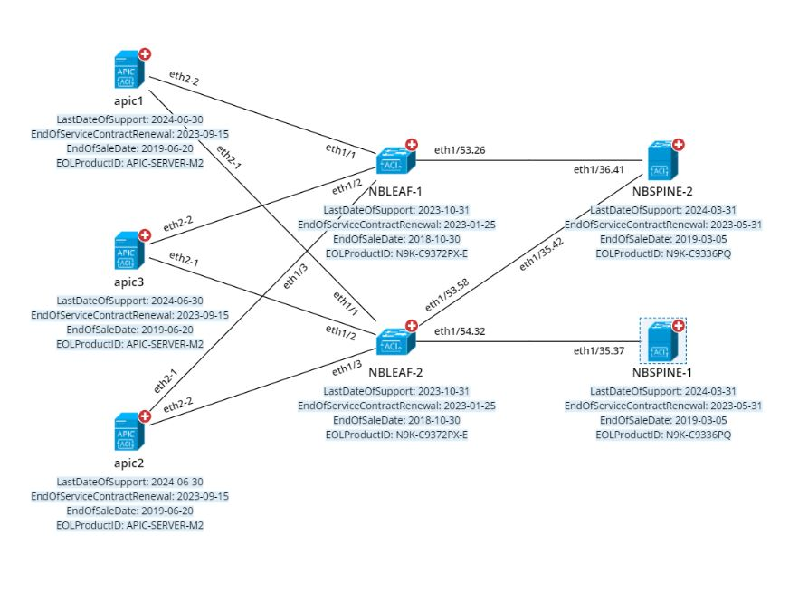
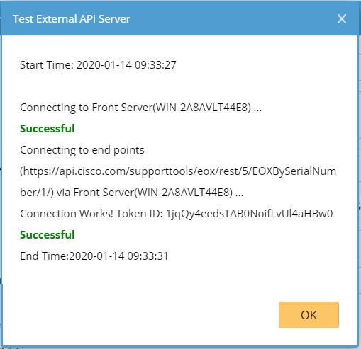
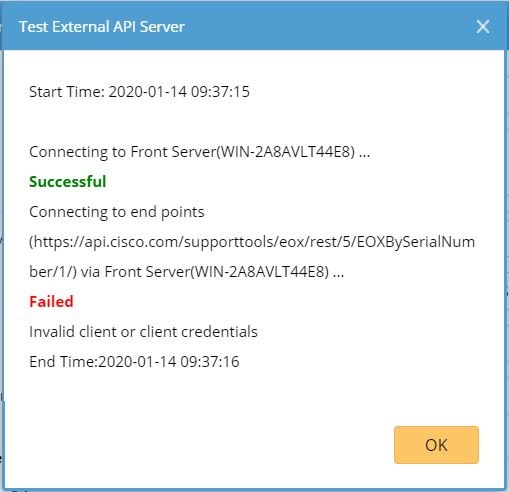
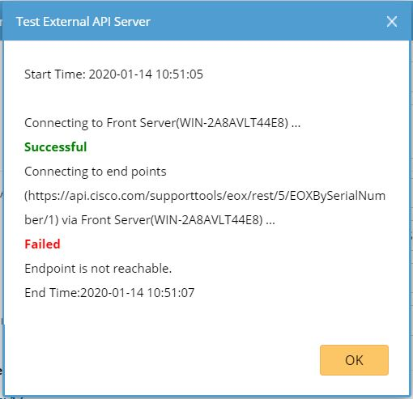

NetBrain Integration Deployment Guide
=====================================

Single Pane of Glass – Cisco SNTC Device Monitoring
------------------------------------------------------------

Use Case
========

Description
-----------

Using the publicly available SNTC API server, NetBrain has created an
integration compatible with NetBrain Integrated Edition release 8.0 (and newer)
that enables a NetBrain administrator to overlay the device data retrieved from Cisco cloud SNTC service and monitoring data on user created maps.

With this integration, NetBrain can overlay the following extended information
as attributes.
Device level:
1. EOLProductID
2. EndOfSaleDate
3. EndOfServiceContractRenewal
4. LastDateOfSupport

NetBrain Map with SNTC Cloud Service Data Overlay
-----------------------------------------

Below example representations of the integration work flow and SNTC cloud data overlay on devices.

Pre-requisites
==============

Application Version
-------------------

| Application                 | Version                   |
|-----------------------------|---------------------------|
| NetBrain Integrated Edition | IEv8.0 (or newer)         |

Network Connectivity
--------------------

| Source                | Destination       | Protocol   |
|-----------------------|-------------------|------------|
| NetBrain Front Server | Cisco Inventory Cloud | HTTP/HTTPS |

User Account and Privileges
---------------------------

| Application                 | User Account | Required Role Assignment(s) |
|-----------------------------|--------------|-----------------------------|
| NetBrain Integrated Edition | Required     | System Admin                |
| SNTC service                  | Required     | Client           |

Deployment Instructions
=======================

Deploy the NetBrain Cisco SNTC API Adaptor
------------------------------------------

1.  Download the NetBrain Cisco SNTC API Adapter, *Cisco SNTC API Adaptor.py*,
    from the NetBrain github and stage locally on the machine typically used to
    connect to the NetBrain User Interface.

2.  Using a web browser, login to the NetBrain System Management UI using the
    *System Admin* credentials

    *http://\<NetBrain Web Server IP\>/admin*

3.  In the NetBrain System Management UI, Navigate to *Operations \> API
    Adaptors*.

4.  In the *API Adaptors* screen, click “Add”.

5.  Complete the *Add Adaptor* dialog screen as follows:

>   **Adapter Name:** *Cisco SNTC API Adaptor*

>   **Description:** *NetBrain Cisco SNTC API Adaptor*

>   **Script:** *\<Cisco SNTC API Adaptor.py\>*

1.  Review the adaptor configuration, then click “Save”.

2.  Log out of the Netbrain Integrated Edition System Management UI.

Create Cisco SNTC API Server Connection
---------------------------------------

**Note:** If the environment has been deployed with multiple Front Servers,
repeat this section for each of the Front Servers.

1.  Using a web browser, login to the NetBrain Desktop UI using the *System
    Admin* credentials

    http://\<NetBrain Web Server IP\>

2.  Navigate to the NetBrain *API Server Manager*

    *Domain Management \> Operations \> API Server Manager*

3.  In the API Server Manager screen, click “Add”.

4.  Complete the Add API Server dialog screen as follows:

>   **Server Name:** *Cisco SNTC API Server \<Front Server\>*

>   **Description:** *Cisco SNTC*

>   **API Source Type:** *“Cisco SNTC API Adaptor”*

>   **Endpoint:** *Cisco SNTC instance endpoint (ex “http://192.168.31.99”)*

>   **Username:** *Cisco SNTC guest account’s username*

>   **Password:** *Cisco SNTC password*

>   **Front Server/Front Server Group:** Select FS/FSG which would have
>   reachability to Cisco SNTC cloud server

1.  Click “Test” to initiate a connectivity test between the NetBrain front
    server and the Cisco SNTC instance configured. Pictured below is the result
    of a successful connectivity test followed by two typical failure scenarios:
    Incorrect credentials and connectivity between NetBrain and Cisco SNTC Inventory cloud.

| **Successful Connection**  |                                    |
|----------------------------|-------------------------------------------------------------|
| **Error Scenario:** The entered credentials are incorrect. **Possible Resolution:** Confirm credentials specified in the Cisco SNTC API Adaptor configuration and retry.                                         | |
| **Error Scenario:** Cisco SNTC cloud endpoint is unreachable. **Possible Resolution:** Confirm that the NetBrain Front Server(s) can reach the Cisco SNTC platform using 3rd party tools (Ping, Traceroute, Wireshark). Or confirm your endpoint inserted correctly.  | |

 Import Cisco SNTC Data View Template
-------------------------------------

1.  Download the NetBrain Cisco SNTC Dataview Template, *[Cisco SNTC] Monitoring
    Data.xdvt*, from the NetBrain github and stage locally on the machine used
    to connect to the NetBrain User Interface.

2.  Using a web browser, login to the NetBrain Desktop UI with the *System
    Admin* credentials

    *http://\<NetBrain Web Server IP\>*

3.  Navigate to the NetBrain *Data View Template Manager*

    *Start Menu (The Four Dashed Lines) \> Dynamic Map \> Data View Template
    Manager*

4.  Right-Click “Shared Templates in Tenant”, then click “New Folder”.

5.  Name the folder *Cisco SNTC Single Pane of Glass*

6.  Right-Click the “Cisco SNTC Single Pane of Glass” folder, then click “Import
    Template”

7.  In the *Import Data View Template* dialog, click “Add Data View Template …”

8.  Select the *[Cisco SNTC] Monitoring Data.xdvt* file, then click “Open”.

9.  Confirm that the *Import Data View Template* dialog screen reflects the
    following information:

    **Name:** *[Cisco SNTC] Monitoring Data.xdvt*

    **Size:** *8.00k*

    **Status:** *Ready*

    **Related Resources:** *1 Parser*

10. Click “Import” to initiate the import of the data view template to the
    NetBrain system.

>   **Note:** On successful completion, the status will transition from *Ready*
>   to *Successful.* If any other status is reported, retry the operation, then
>   contact NetBrain support.

1.  Navigate to NetBrain *Parser Library*

    *Start Menu (The Four Dashed Lines) \> Automation \> Parser Library*

2.  In the Parser Library, search for “Cisco SNTC – “. One Cisco SNTC parser
    should be returned in the search results:

>   *Cisco SNTC – Device DVT*

1.  Double-click *Cisco SNTC – Device DVT* to open the custom parser in the
    *Parser Editor*.

2.  In the *Parser Editor*, update the *Parser Type* associated with the
    *Cisco SNTC – Device DVT* to the following:

>   **Parser Type:** *API, Cisco SNTC*

1.  Click the Save icon in the upper-right corner of the screen, then close the
    browser tab.

2.  Repeat steps 13-15 for the remaining two NetBrain Cisco SNTC parsers.

Creating Cisco SNTC Enabled Device Groups
-----------------------------------------

**Note:** If the environment has been deployed with multiple Front Servers,
repeat this section for each of the Front Servers.

1.  Navigate to the NetBrain *Device Group Manager.*

    *Start Menu (The Four Dashed Lines) \> Device Group*

2.  In the *Device Group Manager*, right-click the “Public” folder, then click
    “New Device Group”.

3.  In the *Device Group Properties* dialog, Name the device group as follows:

>   *[Cisco SNTC] DG \<Front Server Hostname\>*

1.  Under *Devices and Interfaces*, click “+Dynamic Search”, then “Dynamic
    Search Device”.

2.  In the *Dynamic Search Device* dialog,

    **Search Scope:** *All Devices (default)*

    **Device Criteria:** *Front Server \| Matches \| \<Front Server\>*

    where *\<Front Server\>* is the front server specified in step 3.

3.  Click “Search” to populate the device list to front server mapping.

4.  Click “OK” button to create a *Dynamic Search* association.

5.  In the *Device Group Properties* dialog, click “OK” to complete Device Group
    creation.

6.  In the *Device Group Manager*, right-click the *[Cisco SNTC] \<Front Server
    Hostname\>* object, then click “Open Group Map”.

7.  In the resulting NetBrain device group map, right-click any device, then
    click “Shared Device Settings”.

8.  In the *Shared Device Settings…* dialog, click the select the API tab then
    populate the dropdown fields as follows:

    *Cisco SNTC API Adaptor \| Cisco SNTC API Server \<Front Server\> \|
    \<Select Front Server\>*

9.  Check “Apply above Settings to device group”, then select *[Cisco SNTC] DG
    \<Front Server Hostname\>*

10. In the API tab content table, check *Cisco SNTC API Adaptor*

11. Click “Submit”.

12. Repeat steps 1-14 for each additional deployed Front Server.

Visualizing the Cisco SNTC Data with NetBrain Data View Template
================================================================

On-Demand Data Overlay
----------------------

1.  From the NetBrain Desktop Management UI, open the desired map to overlay
    Cisco SNTC data.

2.  In *Dynamic Data View* tab, search for “[Cisco SNTC] Monitoring Data”.

3.  In the *Preview – Data View Template* dialog, click “Apply”

4.  On the NetBrain map, confirm that the *Cache/Live* data source switch is set
    to *Live.*

5.  Confirm that the objects (devices and interfaces) are properly instrumented
    with the expected Cisco SNTC data.

    **Note:** Overlay of the Cisco SNTC data may take seconds-to-minutes to
    complete refresh depending on the number of devices on the map.

Schedule Data Import from Cisco SNTC
------------------------------------

1.  In the *NetBrain Domain Management* page, navigate to *Schedule Task*.

2.  Click on “Schedule Data View Template/Parser”, then click on “Add Task”

3.  In the *Add Task* dialog, specify the frequency for which to import device
    and interface data from Cisco SNTC.

4.  Click on “Device Scope” tab, then click “Device Group” radio button. Add
    each device group created as part of the integration to limit device scope
    of the available devices.

5.  Click on “Select Data View Template/Parser” tab, click on “Add” and search
    for *[Cisco SNTC] Monitoring Data*

6.  Click “Submit” to create the scheduled task for Cisco SNTC data import to
    NetBrain.

>   **Note:** The Cisco SNTC data will not be available on the map until after
>   the first time that the scheduled task has completed execution.

Troubleshooting
===============

If there are any problems encountered during deployment or integration of
NetBrain with Cisco SNTC, contact NetBrain Support at
*support\@netbraintech.com*.

