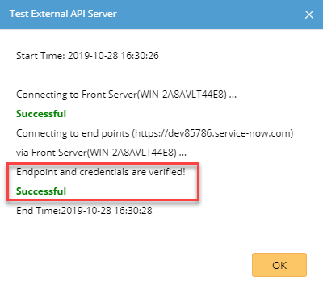

NetBrain Integration Deployment Guide
=====================================

Single Pane of Glass – Solarwinds Device Monitoring
------------------------------------------------------------

Use Case
========

Description
-----------

Using the publicly available Solarwinds Orion SDK, NetBrain has created an
integration compatible with NetBrain Integrated Edition release 8.0 (and newer)
that enables a NetBrain administrator to overlay the Solarwinds device and
interface monitoring data on user created maps.

With this integration, NetBrain can overlay the following extended information
as attributes.
Device level:
1.  CPU Load% (Map URL to Solarwinds device details)
2.  Memory Used %
3.  System Uptime
4.  SysLog messages

Following data is seen on the interface level:
1.  Utilization In %
2.  Utilization Out %
3.  In Discards This Hour
4.  Out Discards This Hour
5.  In Errors This Today
6.  Out Errors This Today
7.  CRC Align Errors Today
8.  MTU

NetBrain Map with Solarwinds Data Overlay
-----------------------------------------

Below are two example representations of the Solarwinds data overlay on devices
(left) and interfaces (right).

Pre-requisites
==============

Application Version
-------------------

| Application                 | Version                   |
|-----------------------------|---------------------------|
| NetBrain Integrated Edition | IEv8.0 (or newer)         |
| Solarwinds                  | Orion NMP 12.2 (or newer) |

Network Connectivity
--------------------

| Source                | Destination       | Protocol   |
|-----------------------|-------------------|------------|
| NetBrain Front Server | Solarwinds server | HTTP/HTTPS |

User Account and Privileges
---------------------------

| Application                 | User Account | Required Role Assignment(s) |
|-----------------------------|--------------|-----------------------------|
| NetBrain Integrated Edition | Required     | System Admin                |
| Solarwinds                  | Required     | Guest (or higher)           |

Deployment Instructions
=======================

Deploy the Solarwinds Orion SDK
-------------------------------

To support Solarwinds data retrieval, the Orion SDK must be deployed on each
Windows based machine where the NetBrain Front Server service is running in the
customer environment.

1.  Download the Solarwinds Orion SDK, *orion.zip*, from the NetBrain github and
    stage locally in the *C:\\Temp* directory on each NetBrain Windows server
    where the Front Server service is currently running.

2.  Log into the first NetBrain Front Server machine with the *administrator*
    user.

3.  Using Windows Explorer, navigate to the *C:\\Temp* directory

4.  Unzip the *orion.zip* file locally in the *C:\\Temp* directory

5.  Copy the resulting directories, *orionsdk* and *orionsdk-0.0.6.dist-info*,
    to the NetBrain Front Server service python library

    *C:\\Program Files\\NetBrain\\Front Server\\python\\Lib\\site-packages*

Deploy the NetBrain Solarwinds API Adaptor
------------------------------------------

1.  Download the NetBrain Solarwinds API Adapter, *Solarwinds API Adaptor.py*,
    from the NetBrain github and stage locally on the machine typically used to
    connect to the NetBrain User Interface.

2.  Using a web browser, login to the NetBrain System Management UI using the
    *System Admin* credentials

    *http://\<NetBrain Web Server IP\>/admin*

3.  In the NetBrain System Management UI, Navigate to *Operations \> API
    Adaptors*.

4.  In the *API Adaptors* screen, click “Add”.

5.  Complete the *Add Adaptor* dialog screen as follows:

>   **Adapter Name:** *Solarwinds API Adaptor*

>   **Description:** *NetBrain Solarwinds API Adaptor*

>   **Script:** *\<Solarwinds API Adaptor.py\>*

1.  Review the adaptor configuration, then click “Save”.

2.  Log out of the Netbrain Integrated Edition System Management UI.

Create Solarwinds API Server Connection
---------------------------------------

**Note:** If the environment has been deployed with multiple Front Servers,
repeat this section for each of the Front Servers.

1.  Using a web browser, login to the NetBrain Desktop UI using the *System
    Admin* credentials

    http://\<NetBrain Web Server IP\>

2.  Navigate to the NetBrain *API Server Manager*

    *Domain Management \> Operations \> API Server Manager*

3.  In the API Server Manager screen, click “Add”.

4.  Complete the Add API Server dialog screen as follows:

>   **Server Name:** *Solarwinds API Server \<Front Server\>*

>   **Description:** *Solarwinds*

>   **API Source Type:** *“Solarwinds API Adaptor”*

>   **Endpoint:** *Solarwinds instance endpoint (ex “http://192.168.31.99”)*

>   **Username:** *Solarwinds guest account’s username*

>   **Password:** *Solarwinds password*

>   **Front Server/Front Server Group:** Select FS/FSG which would have
>   reachability to Solarwinds server

1.  Click “Test” to initiate a connectivity test between the NetBrain front
    server and the Solarwinds instance configured. Pictured below is the result
    of a successful connectivity test followed by two typical failure scenarios:
    Incorrect credentials and connectivity between NetBrain and Solarwinds.

| **Successful Connection**  |                                        |
|----------------------------|-------------------------------------------------------------|
| **Error Scenario:** Solarwinds Orion SDK library isn’t available to by imported by NetBrain’s Plugin   **Possible Resolution:**   Confirm all steps are followed in section Deploy the Solarwinds Orion SDK.                                                                                 |  |
| **Error Scenario:** The entered credentials are incorrect. **Possible Resolution:** Confirm credentials specified in the Solarwinds API Adaptor configuration and retry.                                         |  |
| **Error Scenario:** Solarwinds endpoint is unreachable. **Possible Resolution:** Confirm that the NetBrain Front Server(s) can reach the Solarwinds platform using 3rd party tools (Ping, Traceroute, Wireshark) |  |

### Confirm all steps are followed in section *Deploy the Solarwinds Orion SDK*.

1.  Once successful connection with the local Solarwinds instance has been
    confirmed, click “OK” to finalize Solarwinds server connection.

2.  Repeat Steps 2-6 for each additional deployed Front Server.

 Import Solarwinds Data View Template
-------------------------------------

1.  Download the NetBrain Solarwinds Dataview Template, *[Solarwinds] Monitoring
    Data.xdvt*, from the NetBrain github and stage locally on the machine used
    to connect to the NetBrain User Interface.

2.  Using a web browser, login to the NetBrain Desktop UI with the *System
    Admin* credentials

    *http://\<NetBrain Web Server IP\>*

3.  Navigate to the NetBrain *Data View Template Manager*

    *Start Menu (The Four Dashed Lines) \> Dynamic Map \> Data View Template
    Manager*

4.  Right-Click “Shared Templates in Tenant”, then click “New Folder”.

5.  Name the folder *Solarwinds Single Pane of Glass*

6.  Right-Click the “Solarwinds Single Pane of Glass” folder, then click “Import
    Template”

7.  In the *Import Data View Template* dialog, click “Add Data View Template …”

8.  Select the *[Solarwinds] Monitoring Data.xdvt* file, then click “Open”.

9.  Confirm that the *Import Data View Template* dialog screen reflects the
    following information:

    **Name:** *[Solarwinds] Device, Interface and Syslog Monitoring Data.xdvt*

    **Size:** *12.32k*

    **Status:** *Ready*

    **Related Resources:** *3 Parsers*

10. Click “Import” to initiate the import of the data view template to the
    NetBrain system.

>   **Note:** On successful completion, the status will transition from *Ready*
>   to *Successful.* If any other status is reported, retry the operation, then
>   contact NetBrain support.

1.  Navigate to NetBrain *Parser Library*

    *Start Menu (The Four Dashed Lines) \> Automation \> Parser Library*

2.  In the Parser Library, search for “Solarwinds – “. Three Solarwinds parsers
    should be returned in the search results:

>   *Solarwinds – Device DVT*

>   *Solarwinds – Interface DVT*

>   *Solarwinds – Syslog DVT*

1.  Double-click *Solarwinds – Device DVT* to open the custom parser in the
    *Parser Editor*.

2.  In the *Parser Editor*, update the *Parser Type* associated with the
    *Solarwinds – Device DVT* to the following:

>   **Parser Type:** *API, Solarwinds*

1.  Click the Save icon in the upper-right corner of the screen, then close the
    browser tab.

2.  Repeat steps 13-15 for the remaining two NetBrain Solarwinds parsers.

Creating Solarwinds Enabled Device Groups
-----------------------------------------

**Note:** If the environment has been deployed with multiple Front Servers,
repeat this section for each of the Front Servers.

1.  Navigate to the NetBrain *Device Group Manager.*

    *Start Menu (The Four Dashed Lines) \> Device Group*

2.  In the *Device Group Manager*, right-click the “Public” folder, then click
    “New Device Group”.

3.  In the *Device Group Properties* dialog, Name the device group as follows:

>   *[Solarwinds] DG \<Front Server Hostname\>*

1.  Under *Devices and Interfaces*, click “+Dynamic Search”, then “Dynamic
    Search Device”.

2.  In the *Dynamic Search Device* dialog,

    **Search Scope:** *All Devices (default)*

    **Device Criteria:** *Front Server \| Matches \| \<Front Server\>*

    where *\<Front Server\>* is the front server specified in step 3.

3.  Click “Search” to populate the device list to front server mapping.

4.  Click “OK” button to create a *Dynamic Search* association.

5.  In the *Device Group Properties* dialog, click “OK” to complete Device Group
    creation.

6.  In the *Device Group Manager*, right-click the *[Solarwinds] \<Front Server
    Hostname\>* object, then click “Open Group Map”.

7.  In the resulting NetBrain device group map, right-click any device, then
    click “Shared Device Settings”.

8.  In the *Shared Device Settings…* dialog, click the select the API tab then
    populate the dropdown fields as follows:

    *Solarwinds API Adaptor \| Solarwinds API Server \<Front Server\> \|
    \<Select Front Server\>*

9.  Check “Apply above Settings to device group”, then select *[Solarwinds] DG
    \<Front Server Hostname\>*

10. In the API tab content table, check *Solarwinds API Adaptor*

11. Click “Submit”.

12. Repeat steps 1-14 for each additional deployed Front Server.

Visualizing the Solarwinds Data with NetBrain Data View Template
================================================================

On-Demand Data Overlay
----------------------

1.  From the NetBrain Desktop Management UI, open the desired map to overlay
    Solarwinds data.

2.  In *Dynamic Data View* tab, search for “[Solarwinds] Monitoring Data”.

3.  In the *Preview – Data View Template* dialog, click “Apply”

4.  On the NetBrain map, confirm that the *Cache/Live* data source switch is set
    to *Live.*

5.  Confirm that the objects (devices and interfaces) are properly instrumented
    with the expected Solarwinds data.

    **Note:** Overlay of the Solarwinds data may take seconds-to-minutes to
    complete refresh depending on the number of devices on the map.

Schedule Data Import from Solarwinds
------------------------------------

1.  In the *NetBrain Domain Management* page, navigate to *Schedule Task*.

2.  Click on “Schedule Data View Template/Parser”, then click on “Add Task”

3.  In the *Add Task* dialog, specify the frequency for which to import device
    and interface data from Solarwinds.

4.  Click on “Device Scope” tab, then click “Device Group” radio button. Add
    each device group created as part of the integration to limit device scope
    of the available devices.

5.  Click on “Select Data View Template/Parser” tab, click on “Add” and search
    for *[Solarwinds] Monitoring Data*

6.  Click “Submit” to create the scheduled task for Solarwinds data import to
    NetBrain.

>   **Note:** The Solarwinds data will not be available on the map until after
>   the first time that the scheduled task has completed execution.

Troubleshooting
===============

If there are any problems encountered during deployment or integration of
NetBrain with Solarwinds, contact NetBrain Support at
*support\@netbraintech.com*.
